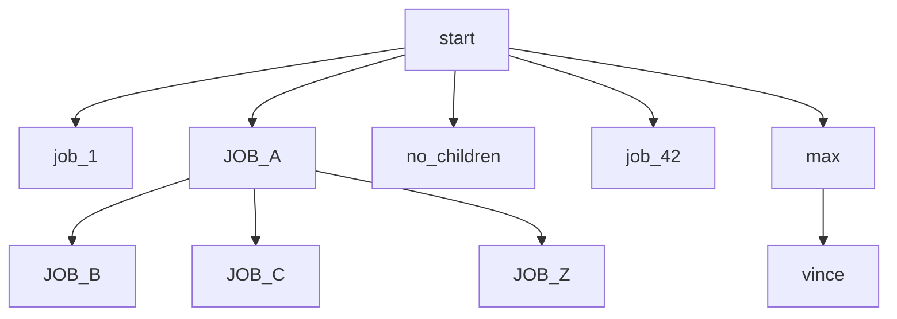
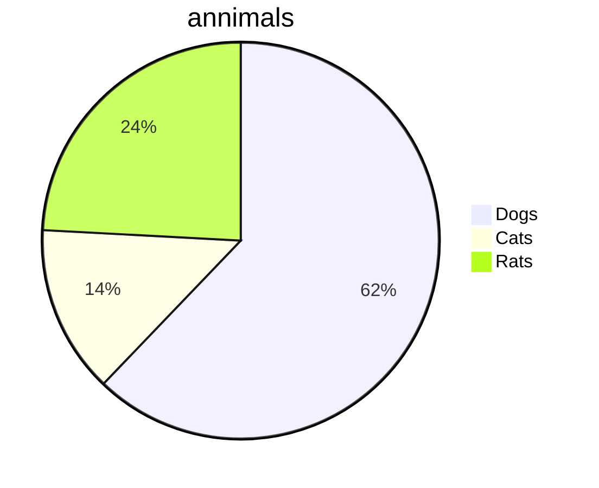
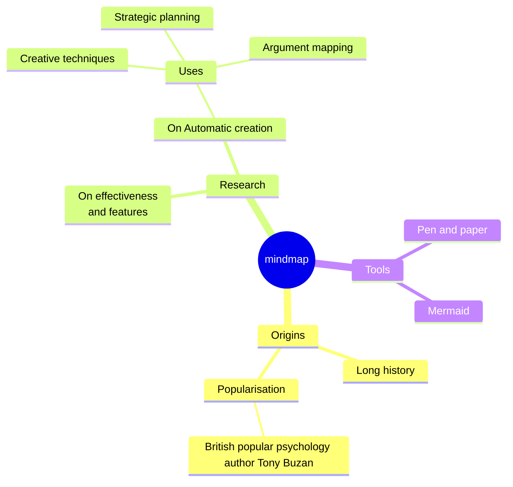
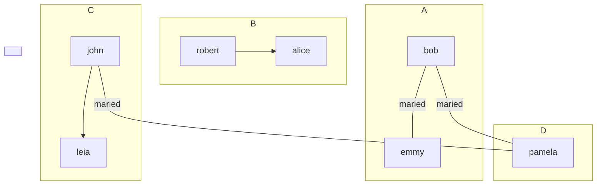

<h1 style="text-align: center">Markdown cheat sheet</h1>

[[_TOC_]]

### Use non-breaking spaces

This line uses             $`\textcolor{red}{\text{red}}`$                  spaces in many places;
they          are              not             collapsed.  
                           There is no need to use code blocks.


### color using latex
$`\textcolor{red}{\text{red}}`$  
$`\textcolor{blue}{\text{blue}}`$  
$`\textcolor{green}{\text{green}}`$  
$`\textcolor{yellow}{\text{yellow}}`$  
$`\textcolor{cyan}{\text{cyan}}`$  
$`\textcolor{magenta}{\text{magenta}}`$  
$`\textcolor{black}{\text{black}}`$  
$`\textcolor{white}{\text{white}}`$  
$`\textcolor{gray}{\text{gray}}`$  
$`\textcolor{brown}{\text{brown}}`$  
$`\textcolor{orange}{\text{orange}}`$  
$`\textcolor{violet}{\text{violet}}`$

### latex colorized table

| First Name | Last Name | Country |
|------------|-----------|---------|
| John       | Do\|e       | USA     |
| Jane       | $`\textcolor{red}{\text{Smi\|th}}`$       | Canada  |
| David      | Lee       | UK      |
| robert      | <del>strike</del>       | UK      |
| Dylan      | <del>$`\textcolor{red}{\text{coucou}}`$</del>       | UK      |

word one                                    word two


### Todo:

- <r>TODO:</r> Important thing to do
- <o>TODO:</o> Less important thing to do
- <g>DONE:</g> Breath deeply and improve karma


### Paragraph
**My Bold Text, in red color.**{: style="color: red; opacity: 0.80;" }


> "In a few moments he was barefoot, his stockings folded in his pockets and his
  canvas shoes dangling by their knotted laces over his shoulders and, picking a
  pointed salt-eaten stick out of the jetsam among the rocks, he clambered down
  the slope of the breakwater."


> His words seemed to have struck some deep chord in his own nature. Had he spoken
of himself, of himself as he was or wished to be? Stephen watched his face for some
moments in silence. A cold sadness was there. He had spoken of himself, of his own
loneliness which he feared.
>
> —Of whom are you speaking? Stephen asked at length.
>
> Cranly did not answer.
>


> 1. Crack three eggs over a bowl.

 Now, you're going to want to crack the eggs in such a way that you don't make a mess.

 If you _do_ make a mess, use a towel to clean it up!

2. Pour a gallon of milk into the bowl.

 Basically, take the same guidance as above: don't be messy, but if you are, clean it up!

3. Rub the salmon vigorously with butter.

   By "vigorous," we mean a strictly vertical motion. Julia Child once quipped:
   > Up and down and all around, that's how butter on salmon goes.
4. Drop the salmon into the egg-milk bowl.

   Here are some techniques on salmon-dropping:

   * Make sure no trout or children are present
   * Use both hands
   * Always have a towel nearby in case of messes
  
  ---

Do I contradict myself?
Very well then I contradict myself,
(I am large, I contain multitudes.)


un ppeu de `texte` et voilà

> ==very important words==


> :information_source: important words

---


> :bulb: imporant


# Emoji

:file_folder: `:file_folder:`  
:bulb: `:bulb:`  
:heavy_exclamation_mark: `:heavy_exclamation_mark:`  
:bangbang: `:bangbang:`  
:interrobang: `:interrobang:`  
:white_check_mark: `:white_check_mark:`  
:sunglasses: `:sunglasses:`  
:information_source: `:information_source:`  
⚠️warning copy as is  
⛔Stop  copy as is  
🤪lol copy as is  
❗Heavy exclamation mark copy as is  


:information_source: fefez

&#8253;


# MERMAID
## graph



## Pie Chart



## Mind Map


## Relations

## ascii table in section for select copy past

```
+------------------+-----+
|       item       | qty |
|       name       |     |
+------------------+-----+
| this text is red | 451 |
|       more       | 42  |
|       spam       |     |
+------------------+-----+
```
