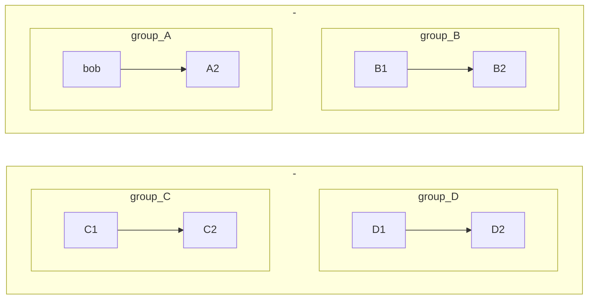

# Archi



<!-- 
```mermaid
someID:::someClass

subgraph someID[Some Title]
    someItem(The subgraph title has some style)
end 

classdef someClass padding-left:5em;
``` -->


```mermaid
graph TB
    sq[Square shape] --> ci((Circle shape))

    subgraph A
        od>Odd shape]-- Two line<br/>edge comment --> ro
        di{Diamond with <br/> line break} -.-> ro(Rounded<br>square<br>shape)
        di==>ro2(Rounded square shape)
    end

    %% Notice that no text in shape are added here instead that is appended further down
    e --> od3>Really long text with linebreak<br>in an Odd shape]

    %% Comments after double percent signs
    e((Inner / circle<br>and some odd <br>special characters)) --> f(,.?!+-*ز)

    cyr[Cyrillic]-->cyr2((Circle shape Начало));

     classDef green fill:red,stroke:#333,stroke-width:2px;
     classDef orange fill:#f96,stroke:#333,stroke-width:4px;
     class sq,e green
     class di orange
```